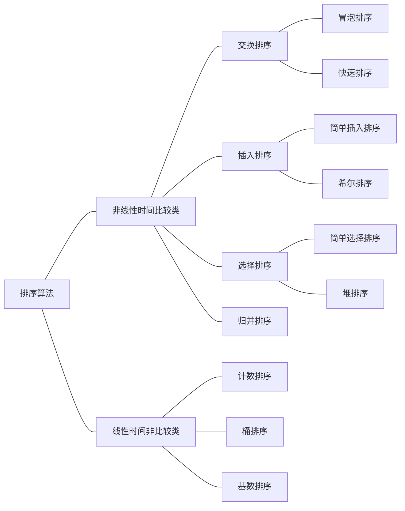

# 十大排序算法—这一篇远远不够

@[TOC](目录)

> 总结之前，并未学习过排序算法，大部分都是看博客学习，如果文章中有错误的地方，欢迎指出~
>
> - 全文以升序为例
>
> - 不详细展开优化算法，可自行在推荐文章中深入
>
>
> - 复杂度分析无严密的数学推导，可参考推荐博文
>
> 排序算法很经典，涉及到很多的数据结构：数组、二叉树、链表、队列等，还有一些常见的算法套路，例如二分、递归、分治....
>
> 如果是初学的话，直接接触这十大算法，可能理解不会那么深，先LeetCode肝些题回头看这些排序，感觉还不错~

<font color=#FF4500 size=5>本文的所有的代码资源 ​ :point_right: :point_right: :point_right: [sort-algorithms-java.tar.gz](https://download.csdn.net/download/qyb19970829/14916860)</font>

***

# 前言

十大常见的排序算法可以分成两大类：<font color= #DC143C>**1. 非线性时间比较类排序**</font> | <font color=#0000C6>**2. 线性时间非比较类排序**</font>

## 非线性时间比较类排序

> 交换类排序（冒泡排序、快速排序）、插入排序（简单插入排序、希尔排序）、选择排序（简单选择排序、堆排序）、归并排序（二路归并和对路归并排序）。

在<font color=#0000C6>非线性时间比较类排序</font>中，<font color=#FF4500>「**归并排序**」最快、其次是「**快速排序**」和「**堆排序**」</font>。但是要注意的是，<font color=#B22222>数组的初始状态</font>对快速排序影响较大，而对堆排序的影响不大。

## 线性时间非比较类排序

> 计数排序、桶排序、基数排序。

<font color=#0000C6>线性时间非比较类排序</font>的时间效率上一般优于<font color= #DC143C>非线性时间比较类排序</font>，但是对于额外内存需求更大，而且该类排序<font color=#B22222>对序列数据本身的要求更加的严格</font>：计数排序的最大值不能太大、桶排序要求数据要尽可能均匀等。




## 十大排序算法复杂度


## 时间复杂度曲线


> 再举一个简单的例子，引自：[归并排序 详解](https://blog.csdn.net/k_koris/article/details/80508543)
>
> 
>
> 当数据量很大的时候 $nlogn$的优势将会比$n^2$越来越大，当$n=10^5$的时候，$nlogn$的算法要比$n^2$的算法快6000倍，那么6000倍是什么概念呢，就是如果我们要处理一个数据集，用$nlogn$的算法要处理一天的话，用$n^2$的算法将要处理6020天。这就基本相当于是15年。一个优化改进的算法可能比一个比一个笨的算法速度快了许多，这就是为什么我们要学习算法。


***

# 01-冒泡排序

> 博客推荐
>
> [冒泡排序](https://blog.csdn.net/u012864854/article/details/79404463)
>
> [排序（一）冒泡排序法](https://blog.csdn.net/Iseno_V/article/details/92212124)
>
> [冒泡排序算法优化](https://blog.csdn.net/wubingju93123/article/details/81215984)
>
> [排序算法之冒泡排序及其优化](https://www.cnblogs.com/minxiang-luo/p/12392618.html)

## 算法逻辑

两个for循环，外循环记录的是比较的趟数，内循环为本趟内的具体数值比较。

> 注意：基本冒泡排序的每次内循环后，右极限需要 - 1。
>

1. 当前元素与后一个元素比较，如果前者大于后者，则交换它们的位置。
2. 每次循环都做相同的比较和交换工作，一次for循环比较下来，则最右边的数字是最大的。
3. 重复外循环完成整个冒泡排序。

## 算法简图

简图来源：[冒泡排序](https://blog.csdn.net/u012864854/article/details/79404463)


## 算法性质

**时间复杂度**

「最好情况」：如果待排序数组是有序的情况下，其时间复杂度为$O(n)$。

「最坏情况」：如果每次判断之后都需要交换元素位置，则此时的时间复杂度为$O(n^2)$。

「平均时间复杂度」：$O(n^2)$，优化后的冒泡排序，最坏情况的时间复杂度可以降低至$O(n)$，和插入排序一样。

**空间复杂度**

对于冒泡排序而言，每次交换过程中都需要一个<font color=#4169E1>临时变量</font>，其他的操作都是在原数组上处理的，没有额外的开辟空间，因此空间复杂度为$O(1)$。

**稳定性**

只有当前一个元素大于后一个元素的时候，才发生交换操作，对于相同大小的元素是不需要交换位置的，所以对于相同元素，其相对位置不会发生改变，因此冒泡排序是<font color=#4169E1>**稳定**</font>的。

<font color=#FF4500 size=6>**算法优化**</font>：[冒泡排序算法优化 ](https://blog.csdn.net/wubingju93123/article/details/81215984) | [排序算法之冒泡排序及其优化](https://www.cnblogs.com/minxiang-luo/p/12392618.html)

***

# 02-快速排序

> 博客推荐
>
> [图解快速排序](https://www.cnblogs.com/MOBIN/p/4681369.html)
>
> [排序--快速排序](https://zhuanlan.zhihu.com/p/93129029)
>
> [快速排序算法详解（原理、实现和时间复杂度）](http://data.biancheng.net/view/117.html)

快速排序是一种分治的排序算法。将一个数组分成两个子数组，将这两部分分别独立的进行排序。其实快速排序也是冒泡排序的升级版本，通过两个双指针，来完成冒泡操作。

## 算法实现

1. 找到一个基准A，并根据这个基准A，将数组分成两个部分。左半边的元素均小于或者等于A，右半边的元素均大于或者等于A。见代码部分的<font color=red>**partition()**</font>方法。一般来说，这个基准A选择该分区的第一个元素即可。

> 注意：如果基准选择是的左边的元素，则在切分方法中，先从右边开始判断！
>
> 详情见：[快速排序法为什么一定要从右边开始的原因](https://blog.csdn.net/lkp1603645756/article/details/85008715)

2. 利用分治思想继续将切分好的分区再次分割，递归调用，直到递归出口条件`left >= right`，完成切分和排序，此时每个元素都处在一个有序的位置。

## 算法简图

动图来源：[排序--快速排序](https://zhuanlan.zhihu.com/p/93129029)


## 算法性质

**时间复杂度**

「最好情况」：如果基准值刚好是数组元素的<font color=#4169E1>**中值**</font>，此时为<font color= #DC143C>**最好情况**</font>，时间复杂度为$O(nlog_2n)$。

「最坏情况」：如果基准值刚好是数组的<font color=#4169E1>**最大**或者**最小**元素</font>，此时为<font color= #DC143C>**最坏情况**</font>，<font color= #DC143C>时间复杂度和直接插入排序是一样高的</font>，移动次数达到最大值，时间复杂度为$O(n^2)$。

「平均时间复杂度」：$O(nlogn)$。

**空间复杂度**

快速排序属于原地排序，占用的空间应该是属于常量级，但是由于每次划分之后的递归调用，在调用函数的过程中会消耗一定的内存。一般认为快速排序的空间复杂度是$O(logn)$。

**稳定性**

快速排序是一个<font color= #DC143C>**不稳定**</font>的算法，在经过排序之后，可能会对相同值的元素的相对位置造成改变。当待排序元素类似[6,1,<font color=#FF4500>**3**</font>,7,<font color=#7B68EE>**3**</font>]且基准元素为6时，经过分区，形成[1,<font color=#7B68EE>**3**</font>,<font color=#FF4500>**3**</font>,6,7],两个3的相对位置发生了改变。

<font color=#FF4500 size=6>**算法优化**</font>：[快速排序及其优化](https://www.cnblogs.com/9dragon/p/10811316.html) | [快速排序的4种优化](https://blog.csdn.net/qq_38289815/article/details/82718428)

# 交换排序类代码实现

```java
/*
 * @description: 交换排序类： 1. 冒泡排序 | 2. 快速排序
 * @author: yuanbaoqiang
 * @date: 2021/1/16 下午7:11
 * @param: null
 * @return:
 */
public class ExchangeSort {
    private static int[] array = {10, 7, 2, 4, 7, 62, 3, 4, 2, 1, 8, 9, 19};

    public static void main(String[] args) {
        // 测试1：冒泡排序
        bubbleSort(array);

        // 测试2：快速排序
        // quickSort(array, 0, array.length - 1);

        // 输出打印
        System.out.println(Arrays.toString(array));
    }

    /****************************--01 冒泡排序--******************************/
    /*
     * @description: 冒泡排序 | 遍历过程中，始终将一个大数往后排。两层for循环
     * @author: yuanbaoqiang
     * @date: 2021/1/16 下午7:16
     * @param: arr
     * @return: void
     */
    public static void bubbleSort(int[] arr) {
        for (int i = 0; i < arr.length; i++) {
            for (int j = 0; j < arr.length - 1 - i; j++) {
                if (arr[j] > arr[j + 1]) {
                    SortUtils.ex(arr, j, j + 1);
                }
            }
        }
    }

    /****************************--02 快速排序--******************************/
    /*
     * @description: 快速排序
     * @author: yuanbaoqiang
     * @date: 2021/1/17 下午8:04
     * @param: arr 需要排序的数组
     * @param: start 起点
     * @param: end 终点
     * @return: void
     */
    public static void quickSort(int[] arr, int start, int end) {
        // 递归函数的出口
        if (start >= end) return;
        // 寻找分割点
        int cutPoint = partition(arr, start, end);
        // 快速排序
        quickSort(arr, start, cutPoint - 1);
        quickSort(arr, cutPoint + 1, end);
    }

    /*
     * @description: 快速排序的切分操作
     * @author: yuanbaoqiang
     * @date: 2021/1/17 下午7:59
     * @param: arr 需要排序的数组
     * @param: lo 分区的左边界
     * @param: hi 分区的右边界
     * @return: int 返回该分区的分割点，这个分割点以左都小于分割点元素，分割点以右都大于分割点元素
     */
    public static int partition(int[] arr, int lo, int hi) {
        int i = lo, j = hi;
        int baseValue = arr[lo];
        while (i < j) {
            // 注意：由于基准值选择的是区间最左边的元素，则需要先 “从右向左” 进行判断（如果基准值取的是左边的值的话）
            // 从右往左，寻找比baseValue更小的数，大于baseValue的元素直接跳过
            while (i < j && arr[j] >= baseValue) j--;
            // 从左往右，寻找比baseValue更大的数，小于baseValue的元素直接跳过
            while (i < j && arr[i] <= baseValue) i++;

            // 经过两次while循环后，此时i的元素大于baseValue，j上的元素大于baseValue，此时需要交换两者的位置
            // 使得比baseValue小的数字相对靠左，比baseValue的数字相对靠右
            // 交换arr[i]和arr[j]
            if (i < j) SortUtils.ex(arr, i, j);
        }
        // 将切分值保留在arr[i]中
        // 此时i == j, 而且在上面的while循环中 先右向左 判断，所以i或j最终所指的数字一定小于或者等于baseValue!!
        SortUtils.ex(arr, lo, i);
        return i;
    }
}
```

***

# 03-插入排序

> 博客推荐
>
> [插入排序（图解）](https://blog.csdn.net/qq_33289077/article/details/90370899)
>
> [插入排序法（详细介绍）](https://blog.csdn.net/weixin_43956598/article/details/90181567)
>
> [排序——插入排序（直接插入排序、希尔排序、折半插入排序）](https://blog.csdn.net/qq_36667170/article/details/103795875?ops_request_misc=%257B%2522request%255Fid%2522%253A%2522161119352616780255277524%2522%252C%2522scm%2522%253A%252220140713.130102334.pc%255Fblog.%2522%257D&request_id=161119352616780255277524&biz_id=0&utm_medium=distribute.pc_search_result.none-task-blog-2~blog~first_rank_v1~rank_blog_v1-2-103795875.pc_v1_rank_blog_v1&utm_term=%E6%8E%92%E5%BA%8F&spm=1018.2226.3001.4450)
>
> [排序算法之插入排序及其优化](https://www.cnblogs.com/minxiang-luo/p/12392630.html)

## 算法逻辑

1. 排序前将这个数组分成两个部分，左半边为已经排序好的序列，右半边为未排序的序列。
2. 默认第一个元素作为已经排好序的一组，剩下的为一组。每次遍历从无序序列的第一个元素开始。
3. 倒序遍历有序序列，依次和等待插入的元素进行比较，符合条件就交换位置。

## 算法简图

简图及文本来源：[排序——插入排序（直接插入排序、希尔排序、折半插入排序）](https://blog.csdn.net/qq_36667170/article/details/103795875?ops_request_misc=%257B%2522request%255Fid%2522%253A%2522161119352616780255277524%2522%252C%2522scm%2522%253A%252220140713.130102334.pc%255Fblog.%2522%257D&request_id=161119352616780255277524&biz_id=0&utm_medium=distribute.pc_search_result.none-task-blog-2~blog~first_rank_v1~rank_blog_v1-2-103795875.pc_v1_rank_blog_v1&utm_term=%E6%8E%92%E5%BA%8F&spm=1018.2226.3001.4450)


例如待排序序列序列`12 15 9 20 6 31 24`

| 初试键值序列 | [ 12 ] 15 9 20 6 31 24 |
| ------------ | ---------------------- |
| 第一趟       | [ 12 15 ] 9 20 6 31 24 |
| 第二趟       | [ 9 12 15 ] 20 6 31 24 |
| 第三趟       | [ 9 12 15 20 ] 6 31 24 |
| 第四趟       | [ 6 9 12 15 20 ] 31 24 |
| 第五趟       | [ 6 9 12 15 20 31 ] 24 |
| 第六趟       | [ 6 9 12 15 20 24 31 ] |

## 算法性质

**时间复杂度**

「最坏情况」：数组如果完全逆序，时间复杂度为$O(n^2)$。

「最好情况」：数组如果完全有序，时间复杂度为$O(n)$。

「平均时间复杂度」：$O(n^2)$。

**空间复杂度**

只需要i, j, temp三个辅助变量，和问题规模无关，空间复杂度为$O(1)$。这一点和冒泡排序也类似，本人的代码temp变量是交换的时候都会创建一个辅助变量的，此时也是属于常量级。

**稳定性**

和冒泡排序类似，插入排序是<font color=#4169E1>**稳定的**</font>。

<font color=#FF4500 size=6>**算法优化**</font>：[排序——插入排序（直接插入排序、希尔排序、折半插入排序）](https://blog.csdn.net/qq_36667170/article/details/103795875?ops_request_misc=%257B%2522request%255Fid%2522%253A%2522161119352616780255277524%2522%252C%2522scm%2522%253A%252220140713.130102334.pc%255Fblog.%2522%257D&request_id=161119352616780255277524&biz_id=0&utm_medium=distribute.pc_search_result.none-task-blog-2~blog~first_rank_v1~rank_blog_v1-2-103795875.pc_v1_rank_blog_v1&utm_term=%E6%8E%92%E5%BA%8F&spm=1018.2226.3001.4450) | [排序算法之插入排序及其优化](https://www.cnblogs.com/minxiang-luo/p/12392630.html)

> 希尔排序就是在插入排序上的优化。

***

# 04-希尔排序

> 博客推荐
>
> [排序：希尔排序（算法）](https://www.jianshu.com/p/d730ae586cf3)
>
> [图解排序算法(二)之希尔排序](https://www.cnblogs.com/chengxiao/p/6104371.html)
>
> [排序算法之 插入排序、希尔（shell）排序 及其时间复杂度和空间复杂度](https://blog.csdn.net/yuzhihui_no1/article/details/44647595)

## 算法逻辑

个人通常使用三个for循环：

1. 第一个for循环，针对的对象是整个数组，将待排序的数组按照一定的增量分组，分成多个子序列。
2. 第二个for循环，针对的对象是分割好的序列对，分别对序列进行插入排序。
3. 第三个for循环，针对的对象是序列内的元素，将待排序部分的元素依次和已排序好序列元素比较交换即可。

> 增量取值范围：$1 \leq d \leq数组长度$
>
> 第一个增量 = 数组长度 / 2
>
> 第二个增量 = 第一个增量 / 2
>
> 第三个增量 = 第二个增量 / 2
>
> 直到最后一个增量为 1，即不可再分的时候，进行最后一次插入排序。

## 算法简图

简图来源：[图解排序算法(二)之希尔排序](https://www.cnblogs.com/chengxiao/p/6104371.html)


## 算法性质

**时间复杂度**

「最好情况」：$O(n^2)。$

「最差情况」：$O(n)$。

**不同增量取值方法会使希尔排序算法的性能有很大差异。**目前还无一个具体的结论关于哪个增量取值是最佳的。在 Knuth所著的《计算机程序设计技巧》第3卷中，利用大量的实验统计资料得出，当n很大时，排序码平均比较次数和元素平均移动次数大约在$n^{1.25}$和$1.6n^{1.25}$范围内，大部分教材中是$O(n^{1.3})$。

**空间复杂度**

空间复杂度为$O(1)$。

**稳定性**

在一次插入排序中是稳定的，但是希尔排序属于多次插入操作排序，相同数值大小的元素可能在各自的插入排序中移动，最后整体的相对顺序发生了改变，因此<font color= #DC143C>**希尔排序是不稳定的**</font>。单次插入排序内为稳定，多次插入排序间<font color= #DC143C>**不稳定**</font>。

<font color=#FF4500 size=6>**希尔排序复杂度分析**</font>：[希尔排序复杂度详细分析（翻译来源：Hans Werner Lang教授）](https://blog.csdn.net/qq_36667170/article/details/103899517?ops_request_misc=%257B%2522request%255Fid%2522%253A%2522161119955316780262594263%2522%252C%2522scm%2522%253A%252220140713.130102334.pc%255Fblog.%2522%257D&request_id=161119955316780262594263&biz_id=0&utm_medium=distribute.pc_search_result.none-task-blog-2~blog~first_rank_v1~rank_blog_v1-3-103899517.pc_v1_rank_blog_v1&utm_term=%E6%8E%92%E5%BA%8F&spm=1018.2226.3001.4450)

<font color=#FF4500 size=6>**算法优化**</font>：[交换和移位](https://blog.csdn.net/qq_44895397/article/details/112000060)

# 插入排序类代码实现

```java
/*
 * @description: 插入排序类： 03-直接插入排序 | 04-希尔排序
 * @author: yuanbaoqiang
 * @date: 2021/1/21 上午10:12
 * @param: null
 * @return:
*/
public class InsertSort {
    private static int[] array = {10,7,2,4,7,62};

    public static void main(String[] args) {
        // 测试1：插入排序
        // insertSort(array);

        // 测试2：希尔排序
        shellSort(array);

        // 输出打印
        System.out.println(Arrays.toString(array));
    }

    /****************************--03 直接插入排序--******************************/
    /*
     * @description: 插入排序 | 将尽可能小的数字放在前面
     * @author: yuanbaoqiang
     * @date: 2021/1/17 下午8:08
     * @param: arr
     * @return: void
    */
    public static void insertSort(int[] arr){
        for(int i = 0; i < arr.length; i++){
            for(int j = i; j > 0; j--){
                if(arr[j - 1] > arr[j]){
                    SortUtils.ex(arr, j - 1, j);
                }
            }
        }
    }

    /****************************--04 希尔排序--******************************/
    public static void shellSort(int[] arr){
        for(int d = arr.length / 2; d > 0; d /= 2){
            // d为每一组子序列的最后一个元素下标
            for(int i = d; i < arr.length; i ++){
                // 从d下标开始，对本级子序列还是直接插入排序
                // i, i - d, i - 2d, i - 3d ....
                for(int j = i - d; j > -1; j -= d){
                    // 此时的有序序列为右半边，所以是arr[j]和arr[j + d]比较
                    if(arr[j] > arr[j + d]){
                        SortUtils.ex(arr, j, j + d);
                    }
                }
            }
        }
    }
}
```


***

# 05-选择排序

> 博客推荐
>
> [选择排序（图解）](https://blog.csdn.net/qq_33289077/article/details/90263964)

## 算法逻辑

两层for循环：

1. 首先在未排序序列中找到最大或者最小值，存放到排序序列的起始位置.
2. 然后在剩余的未排序序列中寻找最大或者最小值，放在排序序列的末尾。
3. 继续外循环遍历。

## 算法简图

简图来源：[选择排序（图解）](https://blog.csdn.net/qq_33289077/article/details/90263964)


## 算法性质

**时间复杂度**

无论是什么样的数据，采用选择排序，时间复杂度都是$O(n^2)$。

**空间复杂度**

空间复杂度为$O(n)$。

**稳定性**

选择排序是<font color=#4169E1>**稳定的**</font>，不会改变相同数值的相对顺序。

***

# 06-堆排序

> 博客推荐
>
> [堆排序](https://www.cnblogs.com/skywang12345/p/3602162.html)
>
> [排序算法 - 堆排序](https://segmentfault.com/a/1190000018337353)
>
> [图解排序算法(三)之堆排序](https://www.cnblogs.com/chengxiao/p/6129630.html)
>
> [堆排序基本原理及实现](https://www.cnblogs.com/harrymore/p/9121886.html)

## 算法逻辑

> 大顶堆和小顶堆概念可参考上述可参考博客。

1. 根据数组创建一个大顶堆，始终保持堆顶为数组中最大的元素。

2. 倒序遍历数组，将数组的最大元素下沉至最后一个节点，并且要相应的维护大顶堆的结构，依次循环。

<font color=#006400>通常来说，如果是**升序排列，则采用大顶堆**。如果是**降序排列，则采用小顶堆**。</font>

> 整个过程最核心的地方就是<font color=#008B8B>堆化过程</font>，父节点和子节点相比较，取最大的孩子节点和父节点交换（如果这个节点大于父节点的话）。这个过程是先从子树开始的，自底向上。

## 算法简图

简图来源：[堆排序基本原理及实现](https://www.cnblogs.com/harrymore/p/9121886.html) | [排序算法之 堆排序 及其时间复杂度和空间复杂度](https://blog.csdn.net/yuzhihui_no1/article/details/44258297)

**大顶堆的调整**


> 堆化过程
>
> 

**大顶堆的创建**


**大顶堆的下沉**


## 算法性质

**时间复杂度**

「最好」、「最坏」和「平均时间复杂度」均为$O(nlogn)$，推导过程可以参考：[排序算法之 堆排序 及其时间复杂度和空间复杂度](https://blog.csdn.net/yuzhihui_no1/article/details/44258297)。

**空间复杂度最优和最差时间复杂度以**

堆排序属于原地排序，空间复杂度为$O(1)$。

**稳定性**

堆排序是<font color= #DC143C>**不稳定的**</font>算法，它不满足稳定算法的定义。它在交换数据的时候，是比较父结点和子节点之间的数据，所以，即便是存在两个数值相等的兄弟节点，它们的相对顺序在排序也可能发生变化。

```
1    2(1)    3     2(2)		2(2)	2(3)
// 建堆
             1
      / 	   		\
    2(1)        	3
    /	\	   	   /
 2(2)	2(2)	2(3)
   
// 大顶堆调整
			3
      / 	   		\
    2(1)        	1
    /	\	   	   /
 2(2)	2(2)	2(3)
 
 			3
      / 	   		\
    2(1)        	2(3)
    /	\	   	   /
 2(2)	2(2)	1
 
此时的相对顺序已经发生了变化，排序的时候2(3)靠前输出。
```

# 选择排序类代码实现

```java
/*
 * @description: 选择排序类： 05-选择排序 | 06-堆排序
 * @author: yuanbaoqiang
 * @date: 2021/1/21 上午11:39
 * @param: null
 * @return:
*/
public class SelectSort {
    private static int[] array = {10,7,2,4,7,62,3,4,2,1,8,9};

    public static void main(String[] args) {
        // 测试1：选择排序
//         selectSort(array);

        // 测试2：堆排序（升序一般使用大顶堆）
        maxHeapSort(array);

        // 输出打印
        System.out.println(Arrays.toString(array));
    }

    /****************************--05 选择排序--******************************/
    /*
     * @description: 直接选择排序
     * @author: yuanbaoqiang
     * @date: 2021/1/18 下午8:21
     * @param: arr
     * @return: void
    */
    public static void selectSort(int[] arr){
        for(int i = 0; i < arr.length; i++){
            // 定义一个最小数下标，之后更小的数，找到就替换
            int minIndex = i;
            for(int j = i + 1; j < arr.length; j++){
                // 只要找到一个比当前的最小数小的数字  就 交换
                // 此时arr[i]的位置上，永远都是i+1, i+2，。。。中最小的数字
                if(arr[j] < arr[minIndex]){
                    // 首先交换两个元素
                    SortUtils.ex(arr, j, minIndex);
                }
            }
        }
    }

    /****************************--06 堆排序--******************************/
    /*
     * @description: 大顶堆排序
     * @author: yuanbaoqiang
     * @date: 2021/1/18 下午10:01
     * @param: arr
     * @return: void
    */
    public static void maxHeapSort(int[] arr){
        // 首先构建出一个最大堆
        buildMaxHeap(arr);

        // 数组的第一个元素，也就是大顶堆的堆顶，此时是最大的元素
        // 如果要升序排列，则需要将这个最大的数 排到最后：
        // 1. 交换堆顶元素 至 最后一个元素
        // 2. 重新调整大顶堆，保持最大的数字在上面
        for(int i = arr.length - 1; i > 0; i--){
            // 始终和数组的第一个元素，也就是大顶堆堆顶交换
            SortUtils.ex(arr, 0, i);
            // 调整大顶堆
            adjustMaxHeap(arr, 0, i);
        }
    }

    /*
     * @description: 构建最大堆
     * @author: yuanbaoqiang
     * @date: 2021/1/18 下午9:39
     * @param: arr
     * @return: void
    */
    public static void buildMaxHeap(int[] arr){
        // 根节点为 i
        // 左节点为 2 * i + 1
        // 右节点为 2 * i + 2
        // 2i + 2 <= len - 1  ----> i < len/2 - 1

        // 根节点必然在数组左半边
        int middlePoint = (arr.length - 3) / 2;

        // 调整最大堆
        for(int i = middlePoint; i > -1; i--){
            adjustMaxHeap(arr, i, arr.length);
        }
    }

    /*
     * @description: 调整最大堆
     * @author: yuanbaoqiang
     * @date: 2021/1/18 下午9:32
     * @param: arr
     * @param: i
     * @param: len
     * @return: void
    */
    public static void adjustMaxHeap(int[] arr, int i, int len) {
        // 根节点
        int rootNode = i;
        // 左节点索引
        int leftNode = 2 * i + 1;
        // 右节点索引
        int rightNode = 2 * i + 2;

        // 左节点索引小于数组长度  &&  左节点的数值大于根节点的数值
        if (leftNode < len && arr[leftNode] > arr[rootNode]) {
            rootNode = leftNode;
        }

        // 右节点索引小于数组长度  &&  右节点的数值大于根节点的数值
        if (rightNode < len && arr[rightNode] > arr[rootNode]) {
            rootNode = rightNode;
        }
        // 如果传入的根节点值没有发生改变，则说明当前传入的节点就是 大顶堆

        // 如果根节点索引值发生了改变，则说明当前传入的节点不是大顶堆
        if(rootNode != i){
            // 交换
            SortUtils.ex(arr, rootNode, i);
            // 递归 ---> 再次调整大顶堆
            adjustMaxHeap(arr, rootNode, len);
        }
    }
}
```

***

# 07-归并排序

> 博客推荐
>
> [归并排序 详解](https://blog.csdn.net/k_koris/article/details/80508543)
>
> [图解排序算法(四)之归并排序](https://www.cnblogs.com/chengxiao/p/6194356.html)
>
> [【算法】排序算法之归并排序](https://zhuanlan.zhihu.com/p/124356219)

## 算法逻辑

采用经典的<font color=#4169E1>**分治策略**</font>。归并排序中的"分"指的就是，将一个数组拆分成二，左半部分和右半部分继续拆分至不可分割的最小单位。而"治"的过程就是将这些小单位再排序组合的过程。

1. 尽可能的将数组拆分成两个元素数量相等的子序列，并对每一个子序列继续拆分，直到拆分后的每个子组的元素个数是1为止。
2. 将相邻的两个子组合并成一个有序的大组。
3. 不断重复2操作。

## 算法简图

简图来源：[图解排序算法(四)之归并排序](https://www.cnblogs.com/chengxiao/p/6194356.html)


## 算法性质

**时间复杂度**

不过数组结构是什么样，都需要经历拆分和合并的过程，「最优」和「最差」时间复杂度以及「平均时间复杂度」都是一样的$O(n)$。

**空间复杂度**

归并的空间开销来源于一个临时数组空间的开辟，空间复杂度为$O(n)$。

**稳定性**

归并排序是一种<font color=#4169E1>**稳定的**</font>排序算法。在合并过程中，如果两个元素相同，其相对位置不会发生改变。

# 二路归并代码实现

```java
/*
 * @description: 归并排序： 07-归并排序
 * @author: yuanbaoqiang
 * @date: 2021/1/19 下午7:52
 * @param: null
 * @return:
*/
public class MergeSort {
    private static int[] array = {10,7,2,4,7,62,3,4,2,1,8,9,19};
    public static void main(String[] args) {
        // 测试1：归并排序
        mergeSort(array);

        // 输出打印
        System.out.println(Arrays.toString(array));
    }


    /****************************--07 归并排序--******************************/
    /*
     * @description:
     * @author: yuanbaoqiang
     * @date: 2021/1/21 下午1:35
     * @param: arr
     * @return: void
    */
    public static void mergeSort(int[] arr){
        // 递归前提前开辟一块固定数组长度，防止因为递归而导致的重复空间开辟
        int[] temp = new int[arr.length];
        mergeSort(arr, 0, arr.length - 1, temp);
    }

    /*
     * @description: 归并排序 | 递归调用 | 分治思想（先分后治）
     * @author: yuanbaoqiang
     * @date: 2021/1/19 下午7:50
     * @param: arr 需要排序的数组
     * @param: left 左边界
     * @param: right 右边界
     * @param: temp 辅助数组
     * @return: void
    */
    public static void mergeSort(int[] arr, int left, int right, int[] temp){
        if(left >= right) return;
        // 首先是将数组分割的过程
        int mid = (left + right) / 2;
        // 1. 分割左半边
        mergeSort(arr, left, mid, temp);
        // 2. 分割右半边
        mergeSort(arr, mid + 1, right, temp);
        // 递归的功能  -->  将两个有序子数组合并
        merge(arr, left, mid, right, temp);
    }

    /*
     * @description: 归并排序
     * @author: yuanbaoqiang
     * @date: 2021/1/19 下午7:16
     * @param: arr 传入的数组
     * @param: left 左边界
     * @param: mid 中点
     * @param: right 右边界
     * @param: temp 额外的数组空间
     * @return: void
    */
    public static void merge(int[] arr, int left, int mid, int right, int[] temp){
        int i = left;
        int j = mid + 1;
        int t = 0;

        while(i <= mid && j <= right){
            if(arr[i] <= arr[j]){
                temp[t++] = arr[i++];
            }else{
                temp[t++] = arr[j++];
            }
        }

        // 将左序列中剩余的元素填充到temp中
        while(i <= mid){
            temp[t++] = arr[i++];
        }

        // 将右序列剩余的元素填充到temp中
        while(j <= right){
            temp[t++] = arr[j++];
        }

        t = 0;

        // 将temp中的元素拷贝到原数组中
        while(left <= right){
            arr[left++] = temp[t++];
        }
    }
}
```

***

# 08-计数排序

> 博客推荐
>
> [计数排序](https://zhuanlan.zhihu.com/p/137576551)

## 算法逻辑

已知一个数组A，最大值为max，额外创建一个数组长度为max + 1的数组B，A数组中的元素与B数组元素的下标一一对应。B数组记录了A数组每个元素的个数。排序的时候，只需要依次遍历B数组即可。

1. 找到数组的最大值max。
2. 创建一个计数数组，长度为max+1。
3. 遍历原数组，并对计数数组开始赋值计数操作。
4. 顺序遍历计数数组，对原数组进行赋值替换操作，并且对于的数量要减去1。

## 算法简图

简图来源：[计数排序](https://zhuanlan.zhihu.com/p/137576551)

**创建桶**


**遍历桶**


## 算法性质

**时间复杂度**

计数排序是复杂度为$O(n + k)$的排序算法，k为待排序数组的最大值。如果对于数组中存在负数，可以使数组整体加上一个整数，使得最小值为0；<font color=#4169E1>如果数组元素的最大值不是很大的时候，采用计数排序相比于比较类排序算法时间效率上会很高。</font>

**空间复杂度**

计数排序过程中用到了长度为k的额外数组，此时的空间复杂度为$O(k)$。

**稳定性**

计数排序是<font color=#4169E1>**稳定的**</font>，不会改变相同元素的相对位置。

# 计数排序代码实现

```java
/*
 * @description: 08-计数排序
 * @author: yuanbaoqiang
 * @date: 2021/1/21 下午1:56
 * @param: null
 * @return: 
*/
public class CountingSort {
    private static int[] array = {10,7,2,4,7,62,3,4,2,1,8,9,19};

    public static void main(String[] args) {
        // 测试1：计数排序
        int maxValue = SortUtils.getMaxValue(array);
        countingSort(array, maxValue);

        // 输出打印
        System.out.println(Arrays.toString(array));
    }

    /****************************--08 计数排序--******************************/
    /*
     * @description: 计数排序
     * @author: yuanbaoqiang
     * @date: 2021/1/20 上午10:16
     * @param: arr
     * @param: maxValue
     * @return: void
    */
    public static void countingSort(int[] arr, int maxValue){
        // 加1是为了所有的下标元素都可以放到新创建的bucket数组中
        // 假如最大值为6，则新建的数组右极限下标也为6，长度则为6+1
        int[] bucket = new int[maxValue + 1];

        // 计数操作 | 此时arr[i]的值就是bucket数组的下标
        for(int num : arr){
            bucket[num]++;
        }

        // 定义一个初始的索引
        int index = 0;

        // 对bucket顺序遍历，如果bucket的值不等于0，说明在这个位置有原arr数组的元素
        for(int i = 0; i < bucket.length; i++){
            while(bucket[i] != 0){
                arr[index++] = i;
                bucket[i]--;
            }
        }
    }
}
```


***

# 09-桶排序

> 博客推荐
>
> [桶排序](https://blog.csdn.net/qq_37186247/article/details/100834916)
>
> [排序算法 - 桶排序](https://www.cnblogs.com/WindSun/p/11361055.html)

## 算法逻辑

<font color=#B22222>桶排序是在计数排序基础上的改进。</font>对于普通的计数排序，根据最大值来创建桶，这样会导致过多的空桶。而采用桶排序，是根据数组的元素的大小范围来创建合适的桶，一个桶内可以装多个元素，最大容量为数组的长度。

假设原数组的最大值为max，最小值为min，长度为len

1. 确定桶的数量为(max - min) / len + 1。
2. 将对应的数据存放在对应的桶里，(arr[i] - min) / len。
3. 对桶内元素进行排序。
4. 遍历创建的所有桶。

## 算法简图

简图来源：[桶排序](https://blog.csdn.net/qq_37186247/article/details/100834916)


## 算法性质

**时间复杂度**

> 可参考：[排序算法-桶排序的时间复杂度分析](https://jeffsheng.blog.csdn.net/article/details/100074146?utm_medium=distribute.pc_relevant.none-task-blog-OPENSEARCH-2.control&depth_1-utm_source=distribute.pc_relevant.none-task-blog-OPENSEARCH-2.control)

需要排序的数据有n个，将其分在m个桶内，每个桶内的数据为k = n / m。

「最好情况」：m和n十分接近的时候，最终复杂度为$O(n)$。

「最坏情况」：所有的数据都在一个桶中，时间复杂度退化为$O(n^2)$。

**空间复杂度**

桶排序空间复杂度为$O(n + k)$。

**稳定性**

算法的稳定性<font color=#4169E1>取决于桶中元素排序时使用的排序算法</font>。<font color=#4682B4>假如使用**直接插入就是稳定的**，加入使用**堆排序就是不稳定的**。</font>

# 桶排序代码实现

```java
/*
 * @description: 桶排序： 09-桶排序
 * @author: yuanbaoqiang
 * @date: 2021/1/21 下午2:16
 * @param: null
 * @return: 
*/
public class BucketSort {MSD方式
    private static int[] array = {10,7,2,4,7,62,3,4,2,1,8,9,19};

    public static void main(String[] args) {
        // 测试1：桶排序
        bucketSort(array);

        // 输出打印
        System.out.println(Arrays.toString(array));
    }


    /****************************--09 桶排序--******************************/
    /*
     * @description: 桶排序
     * @author: yuanbaoqiang
     * @date: 2021/1/21 下午2:15
     * @param: arr
     * @return: void
    */
    public static void bucketSort(int[] arr){
        ArrayList<ArrayList<Integer>> bucketList = bucketSort(arr, SortUtils.getMinValue(arr), SortUtils.getMaxValue(arr));
        int index = 0;
        for (ArrayList<Integer> bucket : bucketList) {
            while(bucket.size() != 0){
                arr[index++] = bucket.get(0);
                bucket.remove(0);
            }
        }
    }

    /*
     * @description: 桶排序 | 得到一个桶的集合，并且桶内元素都完成了排序
     * @author: yuanbaoqiang
     * @date: 2021/1/21 下午2:15
     * @param: arr 
     * @param: min 数组的最小值
     * @param: max 数组的最小值
     * @return: java.util.ArrayList<java.util.ArrayList<java.lang.Integer>>
    */
    public static ArrayList<ArrayList<Integer>> bucketSort(int[] arr, int min, int max){
        // 桶的数量
        int bucketNum = (max - min) / arr.length + 1;
        ArrayList<ArrayList<Integer>> bucketList = new ArrayList<>(bucketNum);
        //
        for(int i = 0; i < bucketNum; i++){
            bucketList.add(new ArrayList<>());
        }

        // 将每个元素放入桶中
        for(int ele : arr){
            // 数组元素对于的桶的编号
            int eleToBucketNum = (ele - min) / arr.length;
            bucketList.get(eleToBucketNum).add(ele);
        }

        // 对每个桶内的元素排序
        for(int i = 0; i < bucketList.size(); i++){
            Collections.sort(bucketList.get(i));
        }
        
        return bucketList;
    }
}
```

***

# 10-基数排序

> 博客推荐
>
> [基数排序](https://www.cnblogs.com/skywang12345/p/3603669.html)
>
> [排序八 基数排序](https://www.cnblogs.com/jingmoxukong/p/4311237.html)
>
> [基数排序与桶排序，计数排序【详解】](https://www.cnblogs.com/ECJTUACM-873284962/p/6935506.html)

## 算法逻辑

基数排序是桶排序的扩展，基本思想是：将数组元素按照尾数分割成不同的数位，然后按照对应权位上的数字进行排序，一般要进行多个轮次，这个<font color=#FF4500>轮次取决于最大值的位数。</font>

> 按照个位进行排序
>
> 按照十位进行排序
>
> 按照百位进行排序
>
> .......
>

基数排序有两种方式：

1. 最高位优先法（MSD：Most Significant Digit First） 

2. 最低位优先法则（LSD：Least Significant Digit First）


本文基于LSD方式，MSD可以参考[基数排序--MSD（桶排序）](https://blog.csdn.net/Anoy_acer/article/details/81047430)。

## 算法简图

简图来源：[基数排序一篇远远不够](https://www.cnblogs.com/skywang12345/p/3603669.html)


## 算法性质

**时间复杂度**

如果r为基数，d为位数，则基数排序的时间复杂度为$O(d * (n+r))$，<font color=#B22222>基数排序的效率和初始序列是否有序**没有关联**。</font>

**空间复杂度**

在基数排序过程中，对于任何位数上的基数进行“装桶”操作时，都需要n+r个临时空间，则空间复杂度为$O(n+r)$。

**稳定性**

在基数排序过程中，每次都是将当前位数上相同数值的元素统一“装桶”，并不需要交换位置。所以基数排序是**稳定**的算法。

# 基数排序代码实现

```java
/*
 * @description: 基数排序
 * @author: yuanbaoqiang
 * @date: 2021/1/21 下午2:27
 * @param: null
 * @return:
*/
public class RadixSort {
    private static int[] array = {50, 3, 542, 745, 2014, 154, 63, 616};

    public static void main(String[] args) {
        // 测试1：基数排序
        radixSort(array);

        // 输出打印
        System.out.println(Arrays.toString(array));
    }


    /****************************--10 基数排序--******************************/
    /*
     * @description: 基数排序
     * @author: yuanbaoqiang
     * @date: 2021/1/21 下午2:23
     * @param: arr
     * @return: void
    */
    public static void radixSort(int[] arr) {
        // 求出最大值
        int maxValue = SortUtils.getMaxValue(arr);
        // 指数
        int exp;

        // 从个位开始10^0
        for (exp = 1; maxValue / exp > 0; exp *= 10) {
            // 存储待排序的临时数组
            int[] temp = new int[arr.length];

            // 桶的个数，0~9
            int[] bucket = new int[10];
            
            // 将数据出现的次数存储在buckets中
            for (int value : arr) {
                // (value / exp) % 10 表示arr[i] 在 对应exp下的最低位
                bucket[(value / exp) % 10]++;
            }

            // 更改bucket[i]的值，是为了让更改后的bucket[i]是temp[]中的位置
            // 0： 1
            // 1： 2
            // 2 : 2
            // ....

            // 假如 1 个 0 占据了 temp[0]
            // 则 2 个 1 分别 占据 temp[1] temp[2] ....
            // bucket[i]表示第i个桶的右边界索引
            for(int i = 1; i < 10; i++){
                bucket[i] += bucket[i - 1];
            }

            // 将数据存储到临时数组中
            for(int i = arr.length - 1; i > -1; i--){
                temp[bucket[(arr[i] / exp) % 10] - 1] = arr[i];
                bucket[(arr[i] / exp) % 10]--;
            }

            // 将排好序的数据赋值给arr[]
            for(int i = 0; i < arr.length; i++){
                arr[i] = temp[i];
            }
        }
    }
}
```

